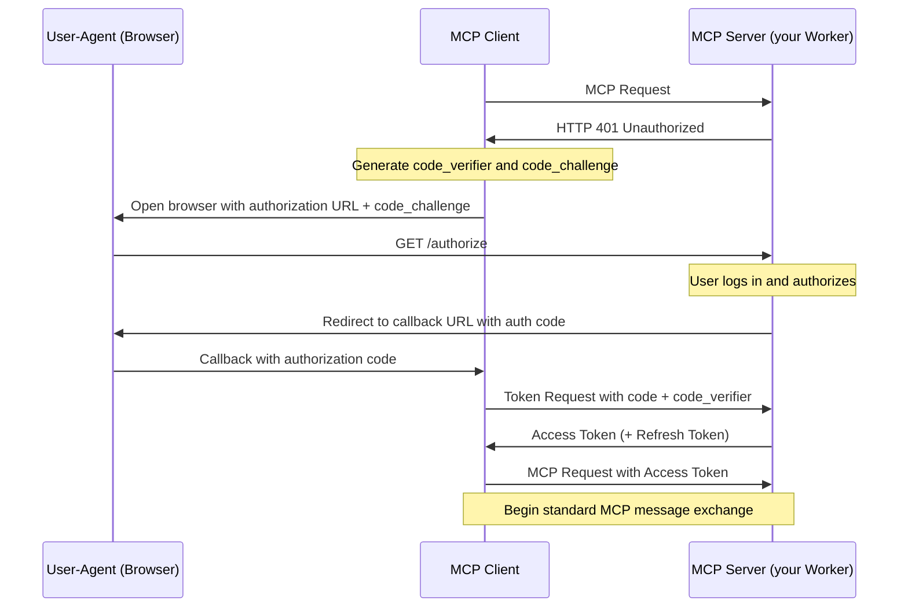
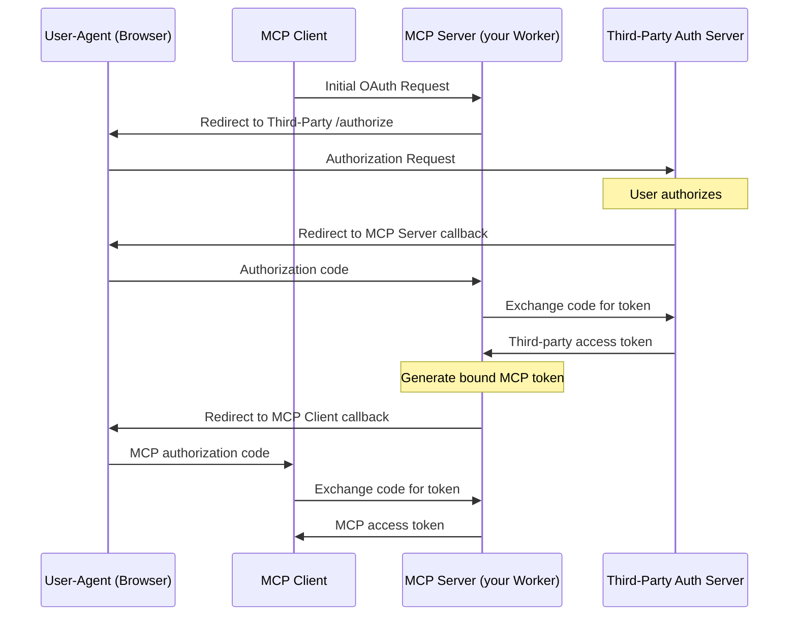

You can build and deploy [Model Context Protocol (MCP)](https://modelcontextprotocol.io/) servers on Cloudflare.

## What is the Model Context Protocol (MCP)?

[Model Context Protocol (MCP)](https://modelcontextprotocol.io) is an open standard that connects AI systems with external applications. Think of MCP like a USB-C port for AI applications. Just as USB-C provides a standardized way to connect your devices to various accessories, MCP provides a standardized way to connect AI agents to different services.

### MCP Terminology

* **MCP Hosts**: AI assistants (like [Claude](http://claude.ai) or [Cursor](http://cursor.com)), AI agents, or applications that need to access external capabilities.
* **MCP Clients**: Clients embedded within the MCP hosts that connect to MCP servers and invoke tools. Each MCP client instance has a single connection to an MCP server.
* **MCP Servers**: Applications that expose [tools](https://developers.cloudflare.com/agents/model-context-protocol/tools/), [prompts](https://modelcontextprotocol.io/docs/concepts/prompts), and [resources](https://modelcontextprotocol.io/docs/concepts/resources) that MCP clients can use.

### Remote vs. local MCP connections

The MCP standard supports two modes of operation:

* **Remote MCP connections**: MCP clients connect to MCP servers over the Internet, establishing a [long-lived connection using HTTP and Server-Sent Events (SSE)](https://developers.cloudflare.com/agents/model-context-protocol/transport/), and authorizing the MCP client access to resources on the user's account using [OAuth](https://developers.cloudflare.com/agents/model-context-protocol/authorization/).
* **Local MCP connections**: MCP clients connect to MCP servers on the same machine, using [stdio](https://spec.modelcontextprotocol.io/specification/draft/basic/transports/#stdio) as a local transport method.

### Best Practices

* **Tool design**: Do not treat your MCP server as a wrapper around your full API schema. Instead, build tools that are optimized for specific user goals and reliable outcomes. Fewer, well-designed tools often outperform many granular ones, especially for agents with small context windows or tight latency budgets.
* **Scoped permissions**: Deploying several focused MCP servers, each with narrowly scoped permissions, reduces the risk of over-privileged access and makes it easier to manage and audit what each server is allowed to do.
* **Tool descriptions**: Detailed parameter descriptions help agents understand how to use your tools correctly — including what values are expected, how they affect behavior, and any important constraints. This reduces errors and improves reliability.
* **Evaluation tests**: Use evaluation tests ('evals') to measure the agent’s ability to use your tools correctly. Run these after any updates to your server or tool descriptions to catch regressions early and track improvements over time.

### Get Started

Go to the [Getting Started](https://developers.cloudflare.com/agents/guides/remote-mcp-server/) guide to learn how to build and deploy your first remote MCP server to Cloudflare.


---
title: Authorization · Cloudflare Agents docs
description: When building a Model Context Protocol (MCP) server, you need both
  a way to allow users to login (authentication) and allow them to grant the MCP
  client access to resources on their account (authorization).
lastUpdated: 2025-05-14T14:20:47.000Z
chatbotDeprioritize: true
source_url:
  html: https://developers.cloudflare.com/agents/model-context-protocol/authorization/
  md: https://developers.cloudflare.com/agents/model-context-protocol/authorization/index.md
---

When building a [Model Context Protocol (MCP)](https://modelcontextprotocol.io) server, you need both a way to allow users to login (authentication) and allow them to grant the MCP client access to resources on their account (authorization).

The Model Context Protocol uses [a subset of OAuth 2.1 for authorization](https://spec.modelcontextprotocol.io/specification/draft/basic/authorization/). OAuth allows your users to grant limited access to resources, without them having to share API keys or other credentials.

Cloudflare provides an [OAuth Provider Library](https://github.com/cloudflare/workers-oauth-provider) that implements the provider side of the OAuth 2.1 protocol, allowing you to easily add authorization to your MCP server.

You can use the OAuth Provider Library in three ways:

1. **Your Worker handles authorization itself.** Your MCP server, running on Cloudflare, handles the complete OAuth flow. ([Example](https://developers.cloudflare.com/agents/guides/remote-mcp-server/))
2. **Integrate directly with a third-party OAuth provider**, such as GitHub or Google.
3. **Integrate with your own OAuth provider**, including authorization-as-a-service providers you might already rely on, such as Stytch, Auth0, or WorkOS.

The following sections describe each of these options and link to runnable code examples for each.

## Authorization options

### (1) Your MCP Server handles authorization and authentication itself

Your MCP Server, using the [OAuth Provider Library](https://github.com/cloudflare/workers-oauth-provider), can handle the complete OAuth authorization flow, without any third-party involvement.

The [Workers OAuth Provider Library](https://github.com/cloudflare/workers-oauth-provider) is a Cloudflare Worker that implements a [`fetch()` handler](https://developers.cloudflare.com/workers/runtime-apis/handlers/fetch/), and handles incoming requests to your MCP server.

You provide your own handlers for your MCP Server's API, and authentication and authorization logic, and URI paths for the OAuth endpoints, as shown below:

```ts
export default new OAuthProvider({
  apiRoute: "/mcp",
  // Your MCP server:
  apiHandler: MyMCPServer.Router,
  // Your handler for authentication and authorization:
  defaultHandler: MyAuthHandler,
  authorizeEndpoint: "/authorize",
  tokenEndpoint: "/token",
  clientRegistrationEndpoint: "/register",
});
```

Refer to the [getting started example](https://developers.cloudflare.com/agents/guides/remote-mcp-server/) for a complete example of the `OAuthProvider` in use, with a mock authentication flow.

The authorization flow in this case works like this:



Remember — [authentication is different from authorization](https://www.cloudflare.com/learning/access-management/authn-vs-authz/). Your MCP Server can handle authorization itself, while still relying on an external authentication service to first authenticate users. The [example](https://developers.cloudflare.com/agents/guides/remote-mcp-server) in getting started provides a mock authentication flow. You will need to implement your own authentication handler — either handling authentication yourself, or using an external authentication services.

### (2) Third-party OAuth Provider

The [OAuth Provider Library](https://github.com/cloudflare/workers-oauth-provider) can be configured to use a third-party OAuth provider, such as GitHub or Google. You can see a complete example of this in the [GitHub example](https://developers.cloudflare.com/agents/guides/remote-mcp-server/#add-authentication).

When you use a third-party OAuth provider, you must provide a handler to the `OAuthProvider` that implements the OAuth flow for the third-party provider.

```ts
import MyAuthHandler from "./auth-handler";


export default new OAuthProvider({
  apiRoute: "/mcp",
  // Your MCP server:
  apiHandler: MyMCPServer.Router,
  // Replace this handler with your own handler for authentication and authorization with the third-party provider:
  
  authorizeEndpoint: "/authorize",
  tokenEndpoint: "/token",
  clientRegistrationEndpoint: "/register",
});
```

Note that as [defined in the Model Context Protocol specification](https://spec.modelcontextprotocol.io/specification/draft/basic/authorization/#292-flow-description) when you use a third-party OAuth provider, the MCP Server (your Worker) generates and issues its own token to the MCP client:



Read the docs for the [Workers oAuth Provider Library](https://github.com/cloudflare/workers-oauth-provider) for more details.

### (3) Bring your own OAuth Provider

If your application already implements an OAuth Provider itself, or you use [Stytch](https://stytch.com/), [Auth0](https://auth0.com/), [WorkOS](https://workos.com/), or authorization-as-a-service provider, you can use this in the same way that you would use a third-party OAuth provider, described above in (2).

You can use the auth provider to:

* Allow users to authenticate to your MCP server through email, social logins, SSO (single sign-on), and MFA (multi-factor authentication).
* Define scopes and permissions that directly map to your MCP tools.
* Present users with a consent page corresponding with the requested permissions.
* Enforce the permissions so that agents can only invoke permitted tools.

#### Stytch

Get started with a [remote MCP server that uses Stytch](https://stytch.com/docs/guides/connected-apps/mcp-servers) to allow users to sign in with email, Google login or enterprise SSO and authorize their AI agent to view and manage their company's OKRs on their behalf. Stytch will handle restricting the scopes granted to the AI agent based on the user's role and permissions within their organization. When authorizing the MCP Client, each user will see a consent page that outlines the permissions that the agent is requesting that they are able to grant based on their role.

[](https://deploy.workers.cloudflare.com/?url=https://github.com/cloudflare/ai/tree/main/demos/mcp-stytch-b2b-okr-manager)

For more consumer use cases, deploy a remote MCP server for a To Do app that uses Stytch for authentication and MCP client authorization. Users can sign in with email and immediately access the To Do lists associated with their account, and grant access to any AI assistant to help them manage their tasks.

[](https://deploy.workers.cloudflare.com/?url=https://github.com/cloudflare/ai/tree/main/demos/mcp-stytch-consumer-todo-list)

#### Auth0

Get started with a remote MCP server that uses Auth0 to authenticate users through email, social logins, or enterprise SSO to interact with their todos and personal data through AI agents. The MCP server securely connects to API endpoints on behalf of users, showing exactly which resources the agent will be able to access once it gets consent from the user. In this implementation, access tokens are automatically refreshed during long running interactions.

To set it up, first deploy the protected API endpoint:

[](https://deploy.workers.cloudflare.com/?url=https://github.com/cloudflare/ai/tree/main/demos/remote-mcp-auth0/todos-api)

Then, deploy the MCP server that handles authentication through Auth0 and securely connects AI agents to your API endpoint.

[](https://deploy.workers.cloudflare.com/?url=https://github.com/cloudflare/ai/tree/main/demos/remote-mcp-auth0/mcp-auth0-oidc)

#### WorkOS

Get started with a remote MCP server that uses WorkOS's AuthKit to authenticate users and manage the permissions granted to AI agents. In this example, the MCP server dynamically exposes tools based on the user's role and access rights. All authenticated users get access to the `add` tool, but only users who have been assigned the `image_generation` permission in WorkOS can grant the AI agent access to the image generation tool. This showcases how MCP servers can conditionally expose capabilities to AI agents based on the authenticated user's role and permission.

[](https://deploy.workers.cloudflare.com/?url=https://github.com/cloudflare/ai/tree/main/demos/remote-mcp-authkit)

## Using Authentication Context in Your MCP Server

When a user authenticates to your MCP server through Cloudflare's OAuth Provider, their identity information and tokens are made available through the `props` parameter.

```js
export class MyMCP extends McpAgent<Env, unknown, AuthContext> {
  async init() {
    this.server.tool("userInfo", "Get user information", {}, async () => ({
      content: [{ type: "text", text: `Hello, ${this.props.claims.name || "user"}!` }],
    }));
  }
}
```

The authentication context can be used for:

* Accessing user-specific data by using the user ID (this.props.claims.sub) as a key
* Checking user permissions before performing operations
* Customizing responses based on user preferences or attributes
* Using authentication tokens to make requests to external services on behalf of the user
* Ensuring consistency when users interact with your application through different interfaces (dashboard, API, MCP server)

## Implementing Permission-Based Access for MCP Tools

You can implement fine-grained authorization controls for your MCP tools based on user permissions. This allows you to restrict access to certain tools based on the user's role or specific permissions.

```js
// Create a wrapper function to check permissions
function requirePermission(permission, handler) {
  return async (request, context) => {
    // Check if user has the required permission
    const userPermissions = context.props.permissions || [];
    if (!userPermissions.includes(permission)) {
      return {
        content: [{ type: "text", text: `Permission denied: requires ${permission}` }],
        status: 403
      };
    }


    // If permission check passes, execute the handler
    return handler(request, context);
  };
}


// Use the wrapper with your MCP tools
async init() {
  // Basic tools available to all authenticated users
  this.server.tool("basicTool", "Available to all users", {}, async () => {
    // Implementation for all users
  });


  // Protected tool using the permission wrapper
  this.server.tool(
    "adminAction",
    "Administrative action requiring special permission",
    { /* parameters */ },
    requirePermission("admin", async (req) => {
      // Only executes if user has "admin" permission
      return {
        content: [{ type: "text", text: "Admin action completed" }]
      };
    })
  );


  // Conditionally register tools based on user permissions
  if (this.props.permissions?.includes("special_feature")) {
    this.server.tool("specialTool", "Special feature", {}, async () => {
      // This tool only appears for users with the special_feature permission
    });
  }
}
```

Benefits:

* Authorization check at the tool level ensures proper access control
* Allows you to define permission checks once and reuse them across tools
* Provides clear feedback to users when permission is denied
* Can choose to only present tools that the agent is able to call

## Next steps

* [Learn how to use the Workers OAuth Provider Library](https://github.com/cloudflare/workers-oauth-provider)
* Learn how to use a third-party OAuth provider, using the [GitHub](https://developers.cloudflare.com/agents/guides/remote-mcp-server/#add-authentication) example MCP server.


---
title: Tools · Cloudflare Agents docs
description: Model Context Protocol (MCP) tools are functions that a MCP Server
  provides and MCP clients can call.
lastUpdated: 2025-03-25T10:04:19.000Z
chatbotDeprioritize: false
source_url:
  html: https://developers.cloudflare.com/agents/model-context-protocol/tools/
  md: https://developers.cloudflare.com/agents/model-context-protocol/tools/index.md
---

Model Context Protocol (MCP) tools are functions that a [MCP Server](https://developers.cloudflare.com/agents/model-context-protocol) provides and MCP clients can call.

When you build MCP Servers with the `@cloudflare/model-context-protocol` package, you can define tools the [same way as shown in the `@modelcontextprotocol/typescript-sdk` package's examples](https://github.com/modelcontextprotocol/typescript-sdk?tab=readme-ov-file#tools).

For example, the following code from [this example MCP server](https://github.com/cloudflare/ai/tree/main/demos/remote-mcp-server) defines a simple MCP server that adds two numbers together:

* JavaScript

  ```js
  import { McpServer } from "@modelcontextprotocol/sdk/server/mcp";
  import { McpAgent } from "agents/mcp";


  export class MyMCP extends McpAgent {
    server = new McpServer({ name: "Demo", version: "1.0.0" });
    async init() {
      this.server.tool(
        "add",
        { a: z.number(), b: z.number() },
        async ({ a, b }) => ({
          content: [{ type: "text", text: String(a + b) }],
        }),
      );
    }
  }
  ```

* TypeScript

  ```ts
  import { McpServer } from "@modelcontextprotocol/sdk/server/mcp";
  import { McpAgent } from "agents/mcp";


  export class MyMCP extends McpAgent {
    server = new McpServer({ name: "Demo", version: "1.0.0" });
    async init() {
      this.server.tool(
        "add",
        { a: z.number(), b: z.number() },
        async ({ a, b }) => ({
          content: [{ type: "text", text: String(a + b) }],
        }),
      );
    }
  }
  ```
 


---
title: Transport · Cloudflare Agents docs
description: "The Model Context Protocol (MCP) specification defines three
  standard transport mechanisms for communication between clients and servers:"
lastUpdated: 2025-05-01T13:39:24.000Z
chatbotDeprioritize: false
source_url:
  html: https://developers.cloudflare.com/agents/model-context-protocol/transport/
  md: https://developers.cloudflare.com/agents/model-context-protocol/transport/index.md
---

The Model Context Protocol (MCP) specification defines three standard [transport mechanisms](https://spec.modelcontextprotocol.io/specification/draft/basic/transports/) for communication between clients and servers:

1. **stdio, communication over standard in and standard out** — designed for local MCP connections.
2. **Server-Sent Events (SSE)** — Currently supported by most remote MCP clients, but is expected to be replaced by Streamable HTTP over time. It requires two endpoints: one for sending requests, another for receiving streamed responses.
3. **Streamable HTTP** — New transport method [introduced](https://modelcontextprotocol.io/specification/2025-03-26/basic/transports#streamable-http) in March 2025. It simplifies the communication by using a single HTTP endpoint for bidirectional messaging. It is currently gaining adoption among remote MCP clients, but it is expected to become the standard transport in the future.

MCP servers built with the [Agents SDK](https://developers.cloudflare.com/agents) can support both remote transport methods (SSE and Streamable HTTP), with the [`McpAgent` class](https://github.com/cloudflare/agents/blob/2f82f51784f4e27292249747b5fbeeef94305552/packages/agents/src/mcp.ts) automatically handling the transport configuration.

## Implementing remote MCP transport

If you're building a new MCP server or upgrading an existing one on Cloudflare, we recommend supporting both remote transport methods (SSE and Streamable HTTP) concurrently to ensure compatibility with all MCP clients.

#### Get started quickly

You can use the "Deploy to Cloudflare" button to create a remote MCP server that automatically supports both SSE and Streamable HTTP transport methods.

[](https://deploy.workers.cloudflare.com/?url=https://github.com/cloudflare/ai/tree/main/demos/remote-mcp-authless)

#### Remote MCP server (without authentication)

If you're manually configuring your MCP server, here's how to use the `McpAgent` class to handle both transport methods:

* JavaScript

  ```js
  export default {
    fetch(request: Request, env: Env, ctx: ExecutionContext) {
      const { pathname } = new URL(request.url);


      if (pathname.startsWith('/sse')) {
        return MyMcpAgent.serveSSE('/sse').fetch(request, env, ctx);
      }


      if (pathname.startsWith('/mcp')) {
        return MyMcpAgent.serve('/mcp').fetch(request, env, ctx);
      }
    },
  };
  ```

* TypeScript

  ```ts
  export default {
    fetch(request: Request, env: Env, ctx: ExecutionContext): Response | Promise<Response> {
      const { pathname } = new URL(request.url);


      if (pathname.startsWith('/sse')) {
        return MyMcpAgent.serveSSE('/sse').fetch(request, env, ctx);
      }


      if (pathname.startsWith('/mcp')) {
        return MyMcpAgent.serve('/mcp').fetch(request, env, ctx);
      }


      // Handle case where no path matches
      return new Response('Not found', { status: 404 });
    },
  };
  ```

* Hono

  ```ts
  const app = new Hono()


  app.mount('/sse', MyMCP.serveSSE('/sse').fetch, { replaceRequest: false })
  app.mount('/mcp', MyMCP.serve('/mcp').fetch, { replaceRequest: false )


  export default app
  ```

#### MCP Server with Authentication

If your MCP server implements authentication & authorization using the [Workers OAuth Provider](https://github.com/cloudflare/workers-oauth-provider) Library, then you can configure it to support both transport methods using the `apiHandlers` property.

```js
export default new OAuthProvider({
  apiHandlers: {
    '/sse': MyMCP.serveSSE('/sse'),
    '/mcp': MyMCP.serve('/mcp'),
  },
  // ... other OAuth configuration
})
```

### Upgrading an Existing Remote MCP Server

If you've already built a remote MCP server using the Cloudflare Agents SDK, make the following changes to support the new Streamable HTTP transport while maintaining compatibility with remote MCP clients using SSE:

* Use `MyMcpAgent.serveSSE('/sse')` for the existing SSE transport. Previously, this would have been `MyMcpAgent.mount('/sse')`, which has been kept as an alias.
* Add a new path with `MyMcpAgent.serve('/mcp')` to support the new Streamable HTTP transport.

If you have an MCP server with authentication/authorization using the Workers OAuth Provider, [update the configuration](https://developers.cloudflare.com/agents/model-context-protocol/transport/#mcp-server-with-authentication) to use the `apiHandlers` property, which replaces `apiRoute` and `apiHandler`.

Note

To use apiHandlers, update to @cloudflare/workers-oauth-provider v0.0.4 or later.

With these few changes, your MCP server will support both transport methods, making it compatible with both existing and new clients.

### Testing with MCP Clients

While most MCP clients have not yet adopted the new Streamable HTTP transport, you can start testing it today using [`mcp-remote`](https://www.npmjs.com/package/mcp-remote), an adapter that lets MCP clients that otherwise only support local connections work with remote MCP servers.

Follow [this guide](https://developers.cloudflare.com/agents/guides/test-remote-mcp-server/) for instructions on how to connect to your remote MCP server from Claude Desktop, Cursor, Windsurf, and other local MCP clients, using the [`mcp-remote` local proxy](https://www.npmjs.com/package/mcp-remote).


---
title: McpAgent — API Reference · Cloudflare Agents docs
description: "When you build MCP Servers on Cloudflare, you extend the McpAgent
  class, from the Agents SDK, like this:"
lastUpdated: 2025-06-05T09:34:13.000Z
chatbotDeprioritize: false
source_url:
  html: https://developers.cloudflare.com/agents/model-context-protocol/mcp-agent-api/
  md: https://developers.cloudflare.com/agents/model-context-protocol/mcp-agent-api/index.md
---

When you build MCP Servers on Cloudflare, you extend the [`McpAgent` class](https://github.com/cloudflare/agents/blob/5881c5d23a7f4580600029f69307cfc94743e6b8/packages/agents/src/mcp.ts), from the Agents SDK, like this:

* JavaScript

  ```js
  import { McpAgent } from "agents/mcp";
  import { McpServer } from "@modelcontextprotocol/sdk/server/mcp.js";
  import { z } from "zod";


  export class MyMCP extends McpAgent {
    server = new McpServer({ name: "Demo", version: "1.0.0" });


    async init() {
      this.server.tool(
        "add",
        { a: z.number(), b: z.number() },
        async ({ a, b }) => ({
          content: [{ type: "text", text: String(a + b) }],
        }),
      );
    }
  }
  ```

* TypeScript

  ```ts
  import { McpAgent } from "agents/mcp";
  import { McpServer } from "@modelcontextprotocol/sdk/server/mcp.js";
  import { z } from "zod";


  export class MyMCP extends McpAgent {
    server = new McpServer({ name: "Demo", version: "1.0.0" });


    async init() {
      this.server.tool(
        "add",
        { a: z.number(), b: z.number() },
        async ({ a, b }) => ({
          content: [{ type: "text", text: String(a + b) }],
        }),
      );
    }
  }
  ```

This means that each instance of your MCP server has its own durable state, backed by a [Durable Object](https://developers.cloudflare.com/durable-objects/), with its own [SQL database](https://developers.cloudflare.com/agents/api-reference/store-and-sync-state).

Your MCP server doesn't necessarily have to be an Agent. You can build MCP servers that are stateless, and just add [tools](https://developers.cloudflare.com/agents/model-context-protocol/tools) to your MCP server using the `@modelcontextprotocol/typescript-sdk` package.

But if you want your MCP server to:

* remember previous tool calls, and responses it provided
* provide a game to the MCP client, remembering the state of the game board, previous moves, and the score
* cache the state of a previous external API call, so that subsequent tool calls can reuse it
* do anything that an Agent can do, but allow MCP clients to communicate with it

You can use the APIs below in order to do so.

#### Hibernation Support

`McpAgent` instances automatically support [WebSockets Hibernation](https://developers.cloudflare.com/durable-objects/best-practices/websockets/#websocket-hibernation-api), allowing stateful MCP servers to sleep during inactive periods while preserving their state. This means your agents only consume compute resources when actively processing requests, optimizing costs while maintaining the full context and conversation history.

Hibernation is enabled by default and requires no additional configuration.

#### Authentication & Authorization

The McpAgent class provides seamless integration with the [OAuth Provider Library](https://github.com/cloudflare/workers-oauth-provider) for [authentication and authorization](https://developers.cloudflare.com/agents/model-context-protocol/authorization/).

When a user authenticates to your MCP server, their identity information and tokens are made available through the `props` parameter, allowing you to:

* access user-specific data
* check user permissions before performing operations
* customize responses based on user attributes
* use authentication tokens to make requests to external services on behalf of the user

### State synchronization APIs

The `McpAgent` class makes the following subset of methods from the [Agents SDK](https://developers.cloudflare.com/agents/api-reference/agents-api/) available:

* [`state`](https://developers.cloudflare.com/agents/api-reference/store-and-sync-state/)
* [`initialState`](https://developers.cloudflare.com/agents/api-reference/store-and-sync-state/#set-the-initial-state-for-an-agent)
* [`setState`](https://developers.cloudflare.com/agents/api-reference/store-and-sync-state/)
* [`onStateUpdate`](https://developers.cloudflare.com/agents/api-reference/store-and-sync-state/#synchronizing-state)
* [`sql`](https://developers.cloudflare.com/agents/api-reference/agents-api/#sql-api)

State resets after the session ends

Currently, each client session is backed by an instance of the `McpAgent` class. This is handled automatically for you, as shown in the [getting started guide](https://developers.cloudflare.com/agents/guides/remote-mcp-server). This means that when the same client reconnects, they will start a new session, and the state will be reset.

For example, the following code implements an MCP server that remembers a counter value, and updates the counter when the `add` tool is called:

* JavaScript

  ```js
  import { McpAgent } from "agents/mcp";
  import { McpServer } from "@modelcontextprotocol/sdk/server/mcp.js";
  import { z } from "zod";


  export class MyMCP extends McpAgent {
    server = new McpServer({
      name: "Demo",
      version: "1.0.0",
    });


    initialState = {
      counter: 1,
    };


    async init() {
      this.server.resource(`counter`, `mcp://resource/counter`, (uri) => {
        return {
          contents: [{ uri: uri.href, text: String(this.state.counter) }],
        };
      });


      this.server.tool(
        "add",
        "Add to the counter, stored in the MCP",
        { a: z.number() },
        async ({ a }) => {
          this.setState({ ...this.state, counter: this.state.counter + a });


          return {
            content: [
              {
                type: "text",
                text: String(`Added ${a}, total is now ${this.state.counter}`),
              },
            ],
          };
        },
      );
    }


    onStateUpdate(state) {
      console.log({ stateUpdate: state });
    }
  }
  ```

* TypeScript

  ```ts
  import { McpAgent } from "agents/mcp";
  import { McpServer } from "@modelcontextprotocol/sdk/server/mcp.js";
  import { z } from "zod";


  type State = { counter: number };


  export class MyMCP extends McpAgent<Env, State, {}> {
    server = new McpServer({
      name: "Demo",
      version: "1.0.0",
    });


    initialState: State = {
      counter: 1,
    };


    async init() {
      this.server.resource(`counter`, `mcp://resource/counter`, (uri) => {
        return {
          contents: [{ uri: uri.href, text: String(this.state.counter) }],
        };
      });


      this.server.tool(
        "add",
        "Add to the counter, stored in the MCP",
        { a: z.number() },
        async ({ a }) => {
          this.setState({ ...this.state, counter: this.state.counter + a });


          return {
            content: [
              {
                type: "text",
                text: String(`Added ${a}, total is now ${this.state.counter}`),
              },
            ],
          };
        },
      );
    }


    onStateUpdate(state: State) {
      console.log({ stateUpdate: state });
    }
  }
  ```

### Not yet supported APIs

The following APIs from the Agents SDK are not yet available on `McpAgent`:

* [WebSocket APIs](https://developers.cloudflare.com/agents/api-reference/websockets/) (`onMessage`, `onError`, `onClose`, `onConnect`)
* [Scheduling APIs](https://developers.cloudflare.com/agents/api-reference/schedule-tasks/) `this.schedule`
