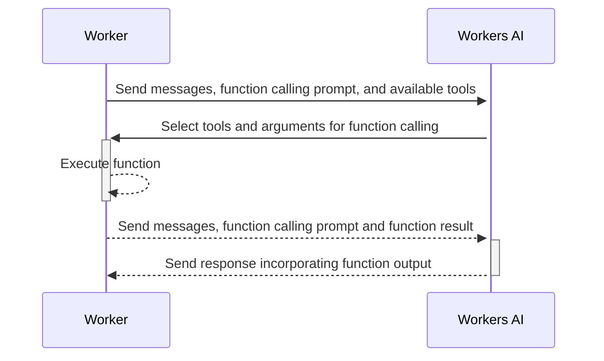

You can use Workers Bindings to interact with the Batch API.

## Send a Batch request

Send your initial batch inference request by composing a JSON payload containing an array of individual inference requests and the `queueRequest: true` property (which is what controlls queueing behavior).

Note

Ensure that the total payload is under 10 MB.

```ts
export interface Env {
  AI: Ai;
}
export default {
  async fetch(request, env): Promise<Response> {
    const embeddings = await env.AI.run(
      "@cf/baai/bge-m3",
      {
        requests: [
          {
            query: "This is a story about Cloudflare",
            contexts: [
              {
                text: "This is a story about an orange cloud",
              },
              {
                text: "This is a story about a llama",
              },
              {
                text: "This is a story about a hugging emoji",
              },
            ],
          },
        ],
      },
      { queueRequest: true },
    );


    return Response.json(embeddings);
  },
} satisfies ExportedHandler<Env>;
```

```json
{
  "status": "queued",
  "model": "@cf/baai/bge-m3",
  "request_id": "000-000-000"
}
```

You will get a response with the following values:

* **`status`**: Indicates that your request is queued.
* **`request_id`**: A unique identifier for the batch request.
* **`model`**: The model used for the batch inference.

Of these, the `request_id` is important for when you need to [poll the batch status](#poll-batch-status).

### Poll batch status

Once your batch request is queued, use the `request_id` to poll for its status. During processing, the API returns a status `queued` or `running` indicating that the request is still in the queue or being processed.

```typescript
export interface Env {
  AI: Ai;
}


export default {
  async fetch(request, env): Promise<Response> {
    const status = await env.AI.run("@cf/baai/bge-m3", {
      request_id: "000-000-000",
    });


    return Response.json(status);
  },
} satisfies ExportedHandler<Env>;
```

```json
{
  "responses": [
    {
      "id": 0,
      "result": {
        "response": [
          { "id": 0, "score": 0.73974609375 },
          { "id": 1, "score": 0.642578125 },
          { "id": 2, "score": 0.6220703125 }
        ]
      },
      "success": true,
      "external_reference": null
    }
  ],
  "usage": { "prompt_tokens": 12, "completion_tokens": 0, "total_tokens": 12 }
}
```

When the inference is complete, the API returns a final HTTP status code of `200` along with an array of responses. Each response object corresponds to an individual input prompt, identified by an `id` that maps to the index of the prompt in your original request.


---
title: REST API · Cloudflare Workers AI docs
description: "If you prefer to work directly with the REST API instead of a
  Cloudflare Worker, below are the steps on how to do it:"
lastUpdated: 2025-04-10T22:24:36.000Z
chatbotDeprioritize: false
source_url:
  html: https://developers.cloudflare.com/workers-ai/features/batch-api/rest-api/
  md: https://developers.cloudflare.com/workers-ai/features/batch-api/rest-api/index.md
---

If you prefer to work directly with the REST API instead of a [Cloudflare Worker](https://developers.cloudflare.com/workers-ai/features/batch-api/workers-binding/), below are the steps on how to do it:

## 1. Sending a Batch Request

Make a POST request using the following pattern. You can pass `external_reference` as a unique ID per-prompt that will be returned in the response.

```bash
curl "https://api.cloudflare.com/client/v4/accounts/$ACCOUNT_ID/ai/run/@cf/baai/bge-m3?queueRequest=true" \
 --header "Authorization: Bearer $API_TOKEN" \
 --header 'Content-Type: application/json' \
 --json '{
    "requests": [
        {
            "query": "This is a story about Cloudflare",
            "contexts": [
                {
                    "text": "This is a story about an orange cloud",
                    "external_reference": "story1"
                },
                {
                    "text": "This is a story about a llama",
                    "external_reference": "story2"
                },
                {
                    "text": "This is a story about a hugging emoji",
                    "external_reference": "story3"
                }
            ]
        }
    ]
  }'
```

```json
{
  "result": {
    "status": "queued",
    "request_id": "768f15b7-4fd6-4498-906e-ad94ffc7f8d2",
    "model": "@cf/baai/bge-m3"
  },
  "success": true,
  "errors": [],
  "messages": []
}
```

## 2. Retrieving the Batch Response

After receiving a `request_id` from your initial POST, you can poll for or retrieve the results with another POST request:

```bash
curl "https://api.cloudflare.com/client/v4/accounts/$ACCOUNT_ID/ai/run/@cf/baai/bge-m3?queueRequest=true" \
 --header "Authorization: Bearer $API_TOKEN" \
 --header 'Content-Type: application/json' \
 --json '{
    "request_id": "<uuid>"
  }'
```

```json
{
  "result": {
    "responses": [
      {
        "id": 0,
        "result": {
          "response": [
            { "id": 0, "score": 0.73974609375 },
            { "id": 1, "score": 0.642578125 },
            { "id": 2, "score": 0.6220703125 }
          ]
        },
        "success": true,
        "external_reference": null
      }
    ],
    "usage": { "prompt_tokens": 12, "completion_tokens": 0, "total_tokens": 12 }
  },
  "success": true,
  "errors": [],
  "messages": []
}
```


---
title: Function calling · Cloudflare Workers AI docs
description: Function calling enables people to take Large Language Models
  (LLMs) and use the model response to execute functions or interact with
  external APIs. The developer usually defines a set of functions and the
  required input schema for each function, which we call tools. The model then
  intelligently understands when it needs to do a tool call, and it returns a
  JSON output which the user needs to feed to another function or API.
lastUpdated: 2025-04-03T16:21:18.000Z
chatbotDeprioritize: false
source_url:
  html: https://developers.cloudflare.com/workers-ai/features/function-calling/
  md: https://developers.cloudflare.com/workers-ai/features/function-calling/index.md
---

Function calling enables people to take Large Language Models (LLMs) and use the model response to execute functions or interact with external APIs. The developer usually defines a set of functions and the required input schema for each function, which we call `tools`. The model then intelligently understands when it needs to do a tool call, and it returns a JSON output which the user needs to feed to another function or API.

In essence, function calling allows you to perform actions with LLMs by executing code or making additional API calls.

## How can I use function calling?

Workers AI has [embedded function calling](https://developers.cloudflare.com/workers-ai/features/function-calling/embedded/) which allows you to execute function code alongside your inference calls. We have a package called [`@cloudflare/ai-utils`](https://www.npmjs.com/package/@cloudflare/ai-utils) to help facilitate this, which we have open-sourced on [Github](https://github.com/cloudflare/ai-utils).

For industry-standard function calling, take a look at the documentation on [Traditional Function Calling](https://developers.cloudflare.com/workers-ai/features/function-calling/traditional/).

To show you the value of embedded function calling, take a look at the example below that compares traditional function calling with embedded function calling. Embedded function calling allowed us to cut down the lines of code from 77 to 31.

* Embedded

  ```sh
  # The ai-utils package enables embedded function calling
  npm i @cloudflare/ai-utils
  ```

  ```js
  import {
    createToolsFromOpenAPISpec,
    runWithTools,
    autoTrimTools,
  } from "@cloudflare/ai-utils";


  export default {
    async fetch(request, env, ctx) {
      const response = await runWithTools(
        env.AI,
        "@hf/nousresearch/hermes-2-pro-mistral-7b",
        {
          messages: [{ role: "user", content: "Who is Cloudflare on github?" }],
          tools: [
            // You can pass the OpenAPI spec link or contents directly
            ...(await createToolsFromOpenAPISpec(
              "https://gist.githubusercontent.com/mchenco/fd8f20c8f06d50af40b94b0671273dc1/raw/f9d4b5cd5944cc32d6b34cad0406d96fd3acaca6/partial_api.github.com.json",
              {
                overrides: [
                  {
                    // for all requests on *.github.com, we'll need to add a User-Agent.
                    matcher: ({ url, method }) => {
                      return url.hostname === "api.github.com";
                    },
                    values: {
                      headers: {
                        "User-Agent":
                          "Mozilla/5.0 (Macintosh; Intel Mac OS X 10_15_7) AppleWebKit/537.36 (KHTML, like Gecko) Chrome/112.0.0.0 Safari/537.36",
                      },
                    },
                  },
                ],
              },
            )),
          ],
        },
      ).then((response) => {
        return response;
      });


      return new Response(JSON.stringify(response));
    },
  };
  ```

* Traditional

  ```js
  export default {
    async fetch(request, env, ctx) {
      const response = await env.AI.run(
        "@hf/nousresearch/hermes-2-pro-mistral-7b",
        {
          messages: [{ role: "user", content: "Who is Cloudflare on GitHub?" }],
          tools: [
            {
              name: "getGithubUser",
              description:
                "Provides publicly available information about someone with a GitHub account.",
              parameters: {
                type: "object",
                properties: {
                  username: {
                    type: "string",
                    description: "The handle for the GitHub user account.",
                  },
                },
                required: ["username"],
              },
            },
          ],
        },
      );


      const selected_tool = response.tool_calls[0];
      let res;


      if (selected_tool.name == "getGithubUser") {
        try {
          const username = selected_tool.arguments.username;
          const url = `https://api.github.com/users/${username}`;
          res = await fetch(url, {
            headers: {
              // Github API requires a User-Agent header
              "User-Agent":
                "Mozilla/5.0 (Macintosh; Intel Mac OS X 10_15_7) AppleWebKit/537.36 (KHTML, like Gecko) Chrome/112.0.0.0 Safari/537.36",
            },
          }).then((res) => res.json());
        } catch (error) {
          return error;
        }
      }


      const finalResponse = await env.AI.run(
        "@hf/nousresearch/hermes-2-pro-mistral-7b",
        {
          messages: [
            {
              role: "user",
              content: "Who is Cloudflare on GitHub?",
            },
            {
              role: "assistant",
              content: JSON.stringify(selected_tool),
            },
            {
              role: "tool",
              content: JSON.stringify(res),
            },
          ],
          tools: [
            {
              name: "getGithubUser",
              description:
                "Provides publicly available information about someone with a GitHub account.",
              parameters: {
                type: "object",
                properties: {
                  username: {
                    type: "string",
                    description: "The handle for the GitHub user account.",
                  },
                },
                required: ["username"],
              },
            },
          ],
        },
      );
      return new Response(JSON.stringify(finalResponse));
    },
  };
  ```

## What models support function calling?

There are open-source models which have been fine-tuned to do function calling. When browsing our [model catalog](https://developers.cloudflare.com/workers-ai/models/), look for models with the function calling property beside it. For example, [@hf/nousresearch/hermes-2-pro-mistral-7b](https://developers.cloudflare.com/workers-ai/models/hermes-2-pro-mistral-7b/) is a fine-tuned variant of Mistral 7B that you can use for function calling.


---
title: Embedded function calling · Cloudflare Workers AI docs
description: Cloudflare has a unique embedded function calling feature that
  allows you to execute function code alongside your tool call inference. Our
  npm package @cloudflare/ai-utils is the developer toolkit to get started.
lastUpdated: 2025-04-03T16:21:18.000Z
chatbotDeprioritize: false
source_url:
  html: https://developers.cloudflare.com/workers-ai/features/function-calling/embedded/
  md: https://developers.cloudflare.com/workers-ai/features/function-calling/embedded/index.md
---

Cloudflare has a unique [embedded function calling](https://blog.cloudflare.com/embedded-function-calling) feature that allows you to execute function code alongside your tool call inference. Our npm package [`@cloudflare/ai-utils`](https://www.npmjs.com/package/@cloudflare/ai-utils) is the developer toolkit to get started.

Embedded function calling can be used to easily make complex agents that interact with websites and APIs, like using natural language to create meetings on Google Calendar, saving data to Notion, automatically routing requests to other APIs, saving data to an R2 bucket - or all of this at the same time. All you need is a prompt and an OpenAPI spec to get started.

REST API support

Embedded function calling depends on features native to the Workers platform. This means that embedded function calling is only supported via [Cloudflare Workers](https://developers.cloudflare.com/workers-ai/get-started/workers-wrangler/), not via the [REST API](https://developers.cloudflare.com/workers-ai/get-started/rest-api/).

## Resources

* [Get Started](https://developers.cloudflare.com/workers-ai/features/function-calling/embedded/get-started/)
* [Examples](https://developers.cloudflare.com/workers-ai/features/function-calling/embedded/examples/)
* [API Reference](https://developers.cloudflare.com/workers-ai/features/function-calling/embedded/api-reference/)
* [Troubleshooting](https://developers.cloudflare.com/workers-ai/features/function-calling/embedded/troubleshooting/)


---
title: Get Started · Cloudflare Workers AI docs
description: This guide will instruct you through setting up and deploying your
  first Workers AI project with embedded function calling. You will use Workers,
  a Workers AI binding, the ai-utils package, and a large language model (LLM)
  to deploy your first AI-powered application on the Cloudflare global network
  with embedded function calling.
lastUpdated: 2025-05-16T16:37:37.000Z
chatbotDeprioritize: false
source_url:
  html: https://developers.cloudflare.com/workers-ai/features/function-calling/embedded/get-started/
  md: https://developers.cloudflare.com/workers-ai/features/function-calling/embedded/get-started/index.md
---

This guide will instruct you through setting up and deploying your first Workers AI project with embedded function calling. You will use Workers, a Workers AI binding, the [`ai-utils package`](https://github.com/cloudflare/ai-utils), and a large language model (LLM) to deploy your first AI-powered application on the Cloudflare global network with embedded function calling.

## 1. Create a Worker project with Workers AI

Follow the [Workers AI Get Started Guide](https://developers.cloudflare.com/workers-ai/get-started/workers-wrangler/) until step 2.

## 2. Install additional npm package

Next, run the following command in your project repository to install the Worker AI utilities package.

* npm

  ```sh
  npm i @cloudflare/ai-utils
  ```

* yarn

  ```sh
  yarn add @cloudflare/ai-utils
  ```

* pnpm

  ```sh
  pnpm add @cloudflare/ai-utils
  ```

## 3. Add Workers AI Embedded function calling

Update the `index.ts` file in your application directory with the following code:

* JavaScript

  ```js
  import { runWithTools } from "@cloudflare/ai-utils";


  export default {
    async fetch(request, env, ctx) {
      // Define function
      const sum = (args) => {
        const { a, b } = args;
        return Promise.resolve((a + b).toString());
      };
      // Run AI inference with function calling
      const response = await runWithTools(
        env.AI,
        // Model with function calling support
        "@hf/nousresearch/hermes-2-pro-mistral-7b",
        {
          // Messages
          messages: [
            {
              role: "user",
              content: "What the result of 123123123 + 10343030?",
            },
          ],
          // Definition of available tools the AI model can leverage
          tools: [
            {
              name: "sum",
              description: "Sum up two numbers and returns the result",
              parameters: {
                type: "object",
                properties: {
                  a: { type: "number", description: "the first number" },
                  b: { type: "number", description: "the second number" },
                },
                required: ["a", "b"],
              },
              // reference to previously defined function
              function: sum,
            },
          ],
        },
      );
      return new Response(JSON.stringify(response));
    },
  };
  ```

* TypeScript

  ```ts
  import { runWithTools } from "@cloudflare/ai-utils";


  type Env = {
    AI: Ai;
  };


  export default {
    async fetch(request, env, ctx) {
      // Define function
      const sum = (args: { a: number; b: number }): Promise<string> => {
        const { a, b } = args;
        return Promise.resolve((a + b).toString());
      };
      // Run AI inference with function calling
      const response = await runWithTools(
        env.AI,
        // Model with function calling support
        "@hf/nousresearch/hermes-2-pro-mistral-7b",
        {
          // Messages
          messages: [
            {
              role: "user",
              content: "What the result of 123123123 + 10343030?",
            },
          ],
          // Definition of available tools the AI model can leverage
          tools: [
            {
              name: "sum",
              description: "Sum up two numbers and returns the result",
              parameters: {
                type: "object",
                properties: {
                  a: { type: "number", description: "the first number" },
                  b: { type: "number", description: "the second number" },
                },
                required: ["a", "b"],
              },
              // reference to previously defined function
              function: sum,
            },
          ],
        },
      );
      return new Response(JSON.stringify(response));
    },
  } satisfies ExportedHandler<Env>;
  ```

This example imports the utils with `import { runWithTools} from "@cloudflare/ai-utils"` and follows the API reference below.

Moreover, in this example we define and describe a list of tools that the LLM can leverage to respond to the user query. Here, the list contains of only one tool, the `sum` function.

Abstracted by the `runWithTools` function, the following steps occur:



The `ai-utils package` is also open-sourced on [Github](https://github.com/cloudflare/ai-utils).

## 4. Local development & deployment

Follow steps 4 and 5 of the [Workers AI Get Started Guide](https://developers.cloudflare.com/workers-ai/get-started/workers-wrangler/) for local development and deployment.

Workers AI Embedded Function Calling charges

Embedded function calling runs Workers AI inference requests. Standard charges for inference (e.g. tokens) usage will be charged. Resources consumed (e.g. CPU time) during embedded functions' code execution will be charged just as any other Worker's code execution.

## API reference

For more details, refer to [API reference](https://developers.cloudflare.com/workers-ai/features/function-calling/embedded/api-reference/).


---
title: Tools based on OpenAPI Spec · Cloudflare Workers AI docs
description: Oftentimes APIs are defined and documented via OpenAPI
  specification. The Cloudflare ai-utils package's createToolsFromOpenAPISpec
  function creates tools from the OpenAPI spec, which the LLM can then leverage
  to fulfill the prompt.
lastUpdated: 2025-04-03T16:21:18.000Z
chatbotDeprioritize: false
tags: AI
source_url:
  html: https://developers.cloudflare.com/workers-ai/features/function-calling/embedded/examples/openapi/
  md: https://developers.cloudflare.com/workers-ai/features/function-calling/embedded/examples/openapi/index.md
---

Oftentimes APIs are defined and documented via [OpenAPI specification](https://swagger.io/specification/). The Cloudflare `ai-utils` package's `createToolsFromOpenAPISpec` function creates tools from the OpenAPI spec, which the LLM can then leverage to fulfill the prompt.

In this example the LLM will describe the a Github user, based Github's API and its OpenAPI spec.

```ts
import { createToolsFromOpenAPISpec, runWithTools } from '@cloudflare/ai-utils';


type Env = {
  AI: Ai;
};


const APP_NAME = 'cf-fn-calling-example-app';


export default {
  async fetch(request, env, ctx) {
    const toolsFromOpenAPISpec = [
      // You can pass the OpenAPI spec link or contents directly
      ...(await createToolsFromOpenAPISpec(
        'https://gist.githubusercontent.com/mchenco/fd8f20c8f06d50af40b94b0671273dc1/raw/f9d4b5cd5944cc32d6b34cad0406d96fd3acaca6/partial_api.github.com.json',
        {
          overrides: [
            {
              matcher: ({ url }) => {
                return url.hostname === 'api.github.com';
              },
              // for all requests on *.github.com, we'll need to add a User-Agent.
              values: {
                headers: {
                  'User-Agent': APP_NAME,
                },
              },
            },
          ],
        }
      )),
    ];


    const response = await runWithTools(
      env.AI,
      '@hf/nousresearch/hermes-2-pro-mistral-7b',
      {
        messages: [
          {
            role: 'user',
            content: 'Who is cloudflare on Github and how many repos does the organization have?',
          },
        ],
        tools: toolsFromOpenAPISpec,
      }
    );


    return new Response(JSON.stringify(response));
  },
} satisfies ExportedHandler<Env>;
```


---
title: Use KV API · Cloudflare Workers AI docs
description: Learn how to use Cloudflare Workers AI to interact with KV storage,
  enabling persistent data handling with embedded function calling in a few
  lines of code.
lastUpdated: 2025-04-03T16:21:18.000Z
chatbotDeprioritize: false
tags: AI
source_url:
  html: https://developers.cloudflare.com/workers-ai/features/function-calling/embedded/examples/kv/
  md: https://developers.cloudflare.com/workers-ai/features/function-calling/embedded/examples/kv/index.md
---

Interact with persistent storage to retrieve or store information enables for powerful use cases.

In this example we show how embedded function calling can interact with other resources on the Cloudflare Developer Platform with a few lines of code.

## Pre-Requisites

For this example to work, you need to provision a [KV](https://developers.cloudflare.com/kv/) namespace first. To do so, follow the [KV - Get started ](https://developers.cloudflare.com/kv/get-started/)guide.

Importantly, your Wrangler file must be updated to include the `KV` binding definition to your respective namespace.

## Worker code

```ts
import { runWithTools } from "@cloudflare/ai-utils";


type Env = {
  AI: Ai;
  KV: KVNamespace;
};


export default {
  async fetch(request, env, ctx) {
    // Define function
    const updateKvValue = async ({
      key,
      value,
    }: {
      key: string;
      value: string;
    }) => {
      const response = await env.KV.put(key, value);
      return `Successfully updated key-value pair in database: ${response}`;
    };


    // Run AI inference with function calling
    const response = await runWithTools(
      env.AI,
      "@hf/nousresearch/hermes-2-pro-mistral-7b",
      {
        messages: [
          { role: "system", content: "Put user given values in KV" },
          { role: "user", content: "Set the value of banana to yellow." },
        ],
        tools: [
          {
            name: "KV update",
            description: "Update a key-value pair in the database",
            parameters: {
              type: "object",
              properties: {
                key: {
                  type: "string",
                  description: "The key to update",
                },
                value: {
                  type: "string",
                  description: "The value to update",
                },
              },
              required: ["key", "value"],
            },
            function: updateKvValue,
          },
        ],
      },
    );
    return new Response(JSON.stringify(response));
  },
} satisfies ExportedHandler<Env>;
```

## Verify results

To verify the results, run the following command

```sh
npx wrangler kv key get banana --binding KV --local
```
