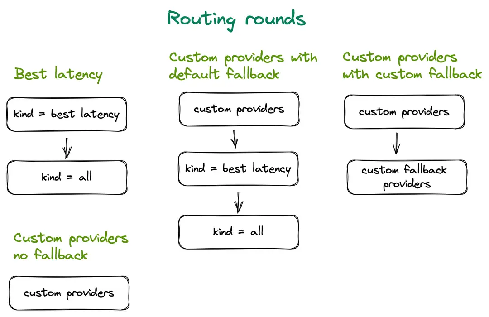
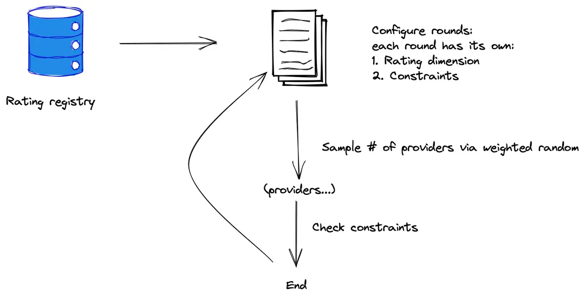

Strategies
Balancing strategies are responsible for provider selection for given request. They always satisfy this interface.

type Strategy interface {
	Next(n int) ([]subjective.View[reducerstates.Address, reducerstates.ProviderId], error)
	GetProviders(factual bool) []reducerstates.ProviderId
	Receive(reducerstates.ProviderId) bool
}
Next(n int) — returns at least n providers, but may return more.

GetProviders(factual bool) — returns list of providers this strategy returned so far. If factual is true we return only those providers that performed meaningful work.

Receive — called from execution flow to notify strategy that some provider completed request successfully.

One-off strategy
This is the most simple strategy. It returns one selected provider once, and then returns error on subsequent calls of Next.

We use it for sticky session methods, as there is no actual routing for it. We have to select specific provider
There are bunch of methods with static responses like net_version, we do not send them to providers and return result right away. So we also use this strategy with special NoProvider provider.
Strategy with retries
This is our default strategy for most of requests. Let’s first discuss essential components of this strategy.

Rating
Provider rating is just a big table where each provider has 1 rating per rating dimension. We discuss rating dimension in details in here. Each rating dimension represents provider performance for some specific set of calls.

You could represent rating dimension as a Go structure:

type RatingDimension struct {
	Kind         DimensionKind
	Cluster      WorkloadCluster
	Chain        dshackle.ChainRef
	SourceRegion reducerstates.Region
}
That’s only reasonable that for different types of methods in different chains provider should have different rating. Here the most interesting parameter is Kind, while other parameters help us to define separate rating for each provider say for each region, you could think about Kind more as a way to filter some providers from our rating table defined by other parameters.

Public — filters only public providers that are free
Best latency — filters only top performers
All — does not filter out anyone
This is important to understand how rounds work.

Balancing rounds
As we set our goals for load-balancing we said that we want to smoothly distribute requests to providers, yet we don’t want to send them to bad performers. This where rounds help us.

The idea is that rounds are a series of ratings with additional constraints that allow us to sample providers not from every provider we have, but from some subsets. This way we can exclude some providers entirely from balancing. However, if for some reason we didn’t find anyone in this round we would fallback to next round.

DRPC has a number of ways to specify a set of providers from which we will select when routing request.

Default case (we call it “best latency”), when nothing explicitly specified. For this case we have 2 rounds: best latency → all. So, if for some reason there are no suitable provider in top performers, we will fallback to “all” rating.
You can specify set of providers manually in request and enable fallback. Then you will have 3 rounds: your custom providers → best latency → all.
You can specify your set of providers with custom set of fallback providers. Then you will have 2 rounds: your custom set of providers → your custom set of fallback providers.
You can specify your set of providers without fallback. Then you will have only one round with your custom set of providers.
Provider selection overview

The basic idea is described on the image above.

We take some rating dimensions from rating registry
We select needed number of providers from those rounds according to given constraints
We return those providers. Also, we guarantee that in a lifetime of this strategy it always returns only distinct providers
However, in practice we should remember that this process is “lazy” it means that we should be ready to select n providers and them m more providers as execution flow requires them.

Internally, this all implemented as several iterators:

Rounds are basically iterator over rounds
Each rating returned by round is also iterator
It means that we first sample randomly some indexes from our rating table according to their ratings
If some of them (or all) can’t be used due to constraints, we just iterate over whole rating table trying to find the closest providers to those we sample
This way we persists strategy state over multiple calls of Next(n int).

Sampling
As we don’t want our algorithm to work by “winner takes all” rule, we want to select providers based on some probability.

Obvious choice for such probability is rating value. So, we used weighted random sampling to sample provider from rating dimension. Bigger rating means bigger chances to be selected, more requests served and more money for provider.

Random sampling is not only more fair, but also this helps us to ramp on and ramp off load smoothly on each provider, so it’s generally better.

Constraints
As we described above, just sampling random provider from list of providers according to their rating is not enough. The problem is that DRPC’s providers are very different, they support different set of methods, have different set of networks, blockchain clients, etc.

You could ask why don’t we encompass all this parameters in provider rating, but this would increase rating dimensionality greatly and would require too much resources.

Instead, we rely on checking request constraints against provider we sampled. Constraints check can yield 3 different answers, what we call provider availability

Available, means that everything is fine and provider can handle given request
Soft unavailable, means that there are some possible problems with providers, however it may handle given request
Unavailable, we pretty certain that this provider can’t handle given request
The actual set of constraints we check for providers is always the same, however some balancing rounds can require only providers that are available, others permit selecting providers which are soft unavailable.

We should remember, that as we use rating dimension, we selecting from providers which already have the chain for given request. But we also need to check:

Does this provider supports method of given request?
Is provider up?
Does this provider have archive nodes (if request required archive node)?
We also use dshackle status
Available maps to available
Lagging maps to soft unavailable
Others (syncing, immature, unavailable) map to unavailable
Retries
Quick word on retries. As this strategy called “with retries”, it allows retries. Typically it allows 1 retry per request.